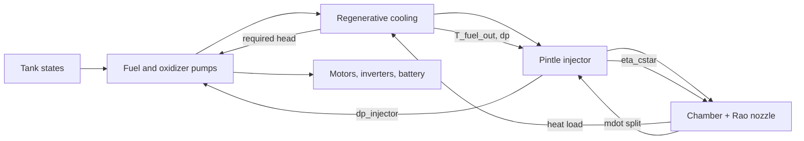
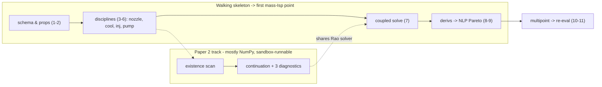

# Differentiable Engine MDO — Plan & Tracker

> **What this document is.** A single source of truth for the differentiable
> engine-MDO workstream in this repository: the mathematical formulation, the
> governing physics of each discipline, the literature each modeling choice
> rests on, and a phase/gate table to track build progress. It is a faithful
> Markdown mirror of `latex-report/Differentiable_Engine_MDO_Plan.pdf`
> (edit both, or regenerate one from the other). Math is kept as LaTeX; the two
> figures are Mermaid so agents can parse them as text.

---

## 0. Agent orientation (read first)

**Project.** LREKit / RaoRocketSim is a Python research toolkit for liquid
rocket engine preliminary design with a differentiable (JAX) physics core. This
document plans the next workstream: turning the existing *sequential* engine
models into one **multidisciplinary-feasible (MDF), end-to-end differentiable**
optimization, and studying the interaction of engine-level optima with the Rao
nozzle **existence boundary**.

**Entry-point files (already exist unless marked NEW):**

| Purpose | Path |
|---|---|
| Sequential orchestrator / one-pass baseline | `raosim/design.py` → `design_nozzle_v2` |
| Differentiable analytic gas dynamics | `raosim/jax/primitives.py` |
| Differentiable thermal + separation screens | `raosim/jax/thermal.py` |
| Implicit-function-theorem solve wrapper | `raosim/jax/bvp.py:69` → `make_differentiable_solution` |
| Rao BVP solve (host-only) | `raosim/jax/api.py` → `solve_rao_bvp_jax` |
| Control-surface Cf sensitivities (J6) | `raosim/jax/sensitivities.py` → `rao_sensitivities` |
| Constrained differentiable design seed | `raosim/jax/design_opt.py` → `constrained_nozzle_design` |
| Existence/cliff scan (smooth vs fan/corner) | `raosim/rao_existence_scan.py` |
| Cooling oracle (NumPy) | `raosim/thermal_design.py` → `size_cooling_channels`, `joint_wall_channel_design` |
| Injector + feed ledger (NumPy) | `raosim/injector.py` |
| Pumps + electric feed (NumPy) | `raosim/pumps.py` → `size_electric_pumps` |
| Thermochemistry | `raosim/cea.py`, `raosim/frozen_flow.py` |
| **NEW MDO layer to build** | `raosim/mdo/` (see §12) |

**How to use this doc.** §1–§10 are the formulation and physics. §11 is the
*definition of done* (phase/gate tracker). §12 is the *build order* (walking
skeleton + phase→code map). §13 is the risk/decision log. If you are an agent
implementing a phase, first read §0.1 (hard rules), then the relevant §6
discipline, then the §12 row for that phase.

### 0.1 Hard rules for implementers (invariants — do not violate)

1. **Never silently substitute a Bézier contour for a failed Rao solve.** A
   branch failure is a scientific result; mark the candidate infeasible.
2. **Pin the c\* convention:** `c*_delivered = eta_cstar * c*_ideal`. Never
   double-count `eta_cstar` between the property surface and the injector closure.
3. **Differentiate converged states via the IFT** (`make_differentiable_solution`
   / `custom_root`). Never differentiate through solver iterations (no unrolling).
4. **Discrete variables stay discrete.** Channel/slot/stage/blade counts,
   materials, bus voltage class, and fixed-vs-movable architecture are enumerated
   in an outer loop — never relaxed into fake continuous variables.
5. **No `max()` inside the differentiable core.** Use stationwise inequalities or
   a verified Kreisselmeier–Steinhauser (KS) aggregate; encode battery
   power/energy limits as epigraph variables.
6. **Every JAX block keeps its NumPy oracle + a parity test** (`~1e-10`), and
   inner residuals are converged ≥100× tighter than the optimizer feasibility
   tolerance before gradients are trusted.
7. **Property surfaces are C¹ and shape-preserving;** constrain the optimizer to
   the tabulated domain; re-evaluate final designs on the authoritative backends
   (CEA / CoolProp). Do not autodiff CEA/CoolProp directly.
8. **Movable-pintle minimum area is two active branches** (tip-opening-limited
   and center-gap-limited) with consistency inequalities — not a differentiable
   `min()`.
9. **Contour fidelity is switched by the question:** analytic TOP-Bézier for
   bulk Pareto sweeps; the implicit variational contour only for
   existence-boundary and exact-vs-TOP studies.
10. **CAD / Boolean geometry generation is post-optimum only** — never inside the
    gradient loop.

---

## 1. Scope and one-paragraph statement

We build a **multidisciplinary-feasible (MDF), end-to-end differentiable** model
of the continuous states of an electric-pump-fed liquid rocket engine, and drive
it with a gradient-based constrained optimizer. Discrete hardware choices are
handled by an **outer enumeration**, not by relaxing integers. "End-to-end
differentiable" means *exact total derivatives of the discretized engineering
models* — not differentiating CAD Booleans, integer counts, or arbitrary
software branches. The engineering novelty is the coupled **total** derivative
through the converged engine state; the physical novelty is the interaction of
engine-level optima with the Rao nozzle **existence boundary** under perfect- and
real-gas thermochemistry.

---

## 2. Corrected literature foundation

The plan's architecture is justified paper-by-paper. Mappings below were checked
against the source PDFs in `propulsion_texts/` (text extracted and read, not
inferred from filenames). One load-bearing attribution was corrected.

### 2.1 The Rao 1958 vs. Rao 1999 correction (load-bearing)

> **Correction.** The claim "the contour must remain an implicit solved state,
> not a Bézier lookup" is *physically correct* but was attributed to the wrong
> source.
>
> - **Rao 1958** establishes that the optimum contour is a constrained
>   variational solution — the control surface is forced to be a characteristic
>   surface and thrust is maximized at fixed mass flow via Lagrange multipliers
>   $\lambda_2,\lambda_3$; Rao states the optimality condition "is *implicit* in
>   the solution" of the governing equations. But Rao 1958 does **not** require
>   an engine MDO to re-solve the contour implicitly at every iterate; the
>   Rao/TOP parabola is a *validated approximation* to that same optimum.
> - The requirement for the implicit contour comes from **Rao 1999**, which
>   defines the **boundary of the valid (shock-free) region** — the "invalid
>   region" where the optimum-thrust control surface can no longer be computed
>   normally. *That boundary is the "Rao cliff."* A Bézier lookup has no such
>   boundary.
>
> **Two consequences:** (i) cite Rao 1999, not Rao 1958, for the
> implicit-contour requirement; (ii) Rao 1999 already computes how *equilibrium
> chemistry shifts the valid-region boundary*, so it is direct prior art for
> **RQ4** (real-gas migration).

**Design consequence — two contour fidelities, switched by the question:**

- *Bulk MDO sweeps* (mass–$I_{sp}$ Pareto): use the analytic Rao/TOP Bézier
  contour. Smooth, cheap, endpoint-exact, adequate for value-of-coupling
  questions.
- *Existence-boundary and exact-vs-TOP studies:* use the implicit
  variational/MOC boundary-value contour as a solved state. Total derivatives to
  the **manufacturable wall** here still require the differentiable kernel/BDE
  march (the "**J3b**" item); until it lands, the kernel $BD$ is a frozen
  artifact and wall-coordinate sensitivities are unavailable. Keep it on the
  critical path only for runs that need it.

### 2.2 Verified source identities

| Cited as | File | Verified identity |
|---|---|---|
| NASA SP-8087 | `19730022965.pdf` | "Liquid Rocket Engine Fluid-Cooled Combustion Chambers" — confirmed (text layer). |
| NASA SP-8109 | `fuel_pump_design/19740020848.pdf` | "…Centrifugal Flow Turbopumps" — confirmed. |
| NASA SP-8052 | `fuel_pump_design/19710025474.pdf` | "…Turbopump Inducers" — confirmed. |
| NASA SP-8089 | `pintle_injector/19760023196.pdf` | **Image scan, no text layer** — identity not text-verifiable; consistent with "…Injectors". Requires OCR to parse. |
| Rao 1958 | `rao1958.pdf` | "Exhaust Nozzle Contour for Optimum Thrust." Page 1 is a spillover references page from the preceding journal article; Rao's text begins p.2. |
| Rao 1999 | `rao1999.pdf` | "Nozzle Optimization for Space-Based Vehicles" — valid/invalid region, equilibrium-chemistry boundary. |

### 2.3 Verified discipline mappings

| Source | Claim used in plan | Verification |
|---|---|---|
| Pizzarelli 2011 | Channel aspect ratio governs stratification, rib conduction, wall temperature, $\Delta p$; throat-only thermal is insufficient. | Confirmed: quasi-2-D (1-D coolant mass/momentum + 2-D energy), $k=h/b$ up to 8 at throat; higher $k$ lowers hot-gas wall temperature via ribs. |
| Son 2017 | Real minimum-area transition (tip-opening vs center-gap limited); model as two branches, not `min()`. | Confirmed: center-gap area vs minimum orifice near pintle tip; explicit "transition of the minimum area." |
| Lee 2021 | Battery mass has separate power- and energy-limited terms; burn duration is an optimization variable. | Confirmed: power density and energy/discharge-time both drive battery mass; voltage droop at short discharge. |
| SP-8087 | Regen cooling as coupled allocation of coolant, $\Delta p$, wall temperature, geometry, life. | Confirmed. |
| SP-8109 / 8052 | Pump RPM and inducer suction/mechanics as a simultaneous constrained design. | Confirmed. |

---

## 3. System boundary and mass ledger

The optimized system runs from the tank outlets and electrical source to the
nozzle exit. Everything excluded must appear explicitly (as zero or a fixed
allowance) in the ledger, so tanks and trajectory can be added later without
changing the engine formulation.

| Inside boundary | Initially excluded (ledger placeholders) |
|---|---|
| Fuel/oxidizer pumps, inducers, motors, inverters, battery | Propellant tanks, pressurant |
| Feed-line and manifold pressure losses | Vehicle structure, TVC |
| Regenerative cooling circuit | Valves, ignition, avionics |
| Pintle injector, chamber, converging section | Transient combustion CFD |
| Rao nozzle and delivered performance | Blade-resolved pump CFD, CAD Booleans |

**Reported masses:** thrust-chamber/nozzle hardware, injector, pumps+inducers,
motors+inverters, battery, total installed propulsion-package mass, and mission
propellant consumed.

---

## 4. Mathematical formulation

### 4.1 Variables and states

Let $a$ be discrete architecture choices, $x_h$ shared continuous hardware
variables, $x_k$ controls at operating point $k$, and $y_k$ the coupled physical
states at point $k$:

$$
x_h=\big[P_c,\,O/F,\,\varepsilon,\,L_\%,\,R_d/R_t,\,L^{*},\,A_c/A_t,\,
t_\mathrm{hot},w_c,h_c,\beta_\mathrm{regen},\,\tfrac{\Delta p_f}{P_c},\tfrac{\Delta p_o}{P_c},\,
D_\mathrm{pintle},N_f,N_o\big]
$$

where $N_f,N_o$ are continuous pump speeds (not blade counts). The minimum
implicit state is

$$
y=\big[\,u_\mathrm{Rao},\,R_t,\,\eta_{c^{*}},\,T_{c,i},P_{c,i},q_i,T_{wg,i},T_{wc,i},\,
Q_f,H_f,Q_o,H_o\,\big].
$$

Relations that are naturally explicit stay explicit; do not enlarge the
nonlinear system merely to appear "coupled."

### 4.2 The MDF optimization problem

$$
\begin{aligned}
\min_{a,\,x_h,\,\{x_k\}}\quad & J\big(x_h,\{x_k\},\{y_k\}\big)\\
\text{s.t.}\quad
& R_k(y_k,x_h,x_k;a)=0 && \text{(engine state, each point } k)\\
& g_k(y_k,x_h,x_k;a)\le 0 && \text{(local constraints)}\\
& G_\mathrm{mission}(\{y_k\},x_h)\le 0. && \text{(shared/mission constraints)}
\end{aligned}
$$

MDF: every optimizer evaluation receives a **converged** engine state $y_k(x)$
satisfying $R_k=0$ (Martins & Lambe 2013; Martins & Ning 2021).

### 4.3 Total derivatives by implicit differentiation

Never differentiate through solver iterations. At a converged state $R(y,x)=0$
the implicit function theorem gives

$$
R_y\,\frac{\mathrm{d}y}{\mathrm{d}x}+R_x=0
\quad\Longrightarrow\quad
\frac{\mathrm{d}y}{\mathrm{d}x}=-R_y^{-1}R_x,
$$

so for any output $f(y,x)$,

$$
\frac{\mathrm{d}f}{\mathrm{d}x}=f_x-f_y\,R_y^{-1}R_x .
$$

The bracketed inverse is realized in one of two modes:

- **Direct/forward:** solve $R_y\,\phi=-R_x$ for state sensitivities
  $\phi=\mathrm{d}y/\mathrm{d}x$ (cost $\propto n_x$ linear solves).
- **Adjoint/reverse:** solve $R_y^{\top}\lambda=f_y^{\top}$, then
  $\dfrac{\mathrm{d}f}{\mathrm{d}x}=f_x-\lambda^{\top}R_x$ (cost $\propto n_f$
  solves). This is the unified-derivatives / MAUD view (Martins & Hwang 2013;
  Hwang & Martins 2018; Gray et al. 2019).

> **Mode selection (honest sizing).** The first engine has $n_x \approx 12$–$20$
> continuous variables but *hundreds* of stationwise constraints. This is **not**
> high-dimensional MDO: adjoint has no asymptotic edge here. Use *forward/direct*
> total derivatives to assemble the full constraint Jacobian in one pass; use the
> *adjoint* only for scalar objectives. The real win over finite differences is
> exactness and freedom from step-size noise, plus tight KKT satisfaction — not
> conquering dimensionality.

### 4.4 Differentiating converged fixed points

Feedback closures (the $\eta_{c^{*}}$ loop, the pump operating point) are fixed
points $y=T(y,x)$ or roots $F(y,x)=0$. Differentiate the *converged* root via the
IFT, implemented with a `custom_root`/`custom_fixed_point` construct (Blondel et
al. 2022; Optimistix), never by unrolling. Inner residuals must be converged at
least 100× tighter than the optimizer feasibility tolerance, or the "exact"
gradient is exact for the wrong equation.

---

## 5. Coupling structure



The two dominant loops are the **combustion/mass-flow** loop

$$
\eta_{c^{*}}\;\rightarrow\;\dot m\;\rightarrow\;\text{injector/spray}\;\rightarrow\;\eta_{c^{*}},
$$

and the **hydraulic/electrical** loop

$$
\big(\Delta p_\mathrm{regen}+\Delta p_\mathrm{injector}+P_c\big)\;\rightarrow\;
H_\mathrm{pump}\;\rightarrow\;\big(P_\mathrm{electric},m_\mathrm{pump},m_\mathrm{battery}\big).
$$

> **Strongest edge, weakest physics.** The $\eta_{c^{*}}$ loop dominates RQ1's
> "value of coupling" *and* is the least trustworthy link — in the current
> repository it is a one-way correlation fixed point, not energy-closed. Run an
> ablation with $\eta_{c^{*}}$ held fixed to bound how much of any Pareto gain
> rests on that correlation, and report the spray–$c^{*}$ coupling value as
> bounded below by correlation fidelity.

---

## 6. Disciplinary models and residual blocks

Gas is a fixed-composition property model; equilibrium chemistry enters only
through precomputed property surfaces (§9).

### 6.1 Nozzle and performance

**Ideal quasi-1-D core.** With ratio of specific heats $\gamma$:

$$
\frac{A}{A^{*}}=\frac{1}{M}\!\left[\frac{2}{\gamma+1}
\Big(1+\tfrac{\gamma-1}{2}M^{2}\Big)\right]^{\frac{\gamma+1}{2(\gamma-1)}},
\qquad
\frac{p}{p_c}=\Big(1+\tfrac{\gamma-1}{2}M^{2}\Big)^{-\frac{\gamma}{\gamma-1}} .
$$

Define the Vandenkerckhove function
$\Gamma(\gamma)=\sqrt{\gamma}\,\big(\tfrac{2}{\gamma+1}\big)^{\frac{\gamma+1}{2(\gamma-1)}}$.
Then

$$
c^{*}_\mathrm{ideal}=\frac{\sqrt{R T_c}}{\Gamma(\gamma)},
\qquad
\boxed{\;\dot m=\frac{P_c A_t}{\eta_{c^{*}}\,c^{*}_\mathrm{ideal}}=\frac{P_c A_t}{c^{*}_\mathrm{delivered}}\;}
$$

with the convention pinned as $c^{*}_\mathrm{delivered}=\eta_{c^{*}}\,c^{*}_\mathrm{ideal}$
(no double-counting). Thrust coefficient and target-thrust closure:

$$
C_F=\sqrt{\frac{2\gamma^{2}}{\gamma-1}\Big(\tfrac{2}{\gamma+1}\Big)^{\frac{\gamma+1}{\gamma-1}}
\!\Big[1-\big(\tfrac{p_e}{p_c}\big)^{\frac{\gamma-1}{\gamma}}\Big]}
+\frac{p_e-p_a}{p_c}\,\varepsilon,
\qquad
F_\mathrm{target}-C_F\,P_c\,\pi R_t^{2}=0,
$$

and $I_{sp}=C_F\,c^{*}_\mathrm{delivered}/g_0$ (SP-125; Anderson; SP-8120).

**Rao optimum contour (implicit fidelity).** The maximum-thrust wall is Rao's
variational solution: along the control surface $DE$ the flow is isentropic and
the surface coincides with a characteristic; stationarity plus mass continuity
and the axisymmetric compatibility relation

$$
\frac{\mathrm{d}r}{\mathrm{d}x}=\tan(\theta\pm\mu),\qquad
\mathrm{d}(\theta\mp\nu)=\mp\,\frac{\sin\theta\sin\mu}{r}\,\mathrm{d}s
\quad(\mu=\arcsin\tfrac1M,\ \nu=\text{Prandtl–Meyer})
$$

close the $B$–$D$–$E$ topology, with Lagrange multipliers enforcing mass/length.
Residual block: $R_\mathrm{Rao}(u_\mathrm{Rao};\varepsilon,L_\%,\gamma,R_d/R_t)=0$.

**Valid region / the "cliff" (Rao 1999).** A shock-free optimum control surface
exists only inside the *valid region*; on its boundary the right characteristic
through $D$ reaches a caustic/envelope and the construction fails. This boundary
— not a Bézier artifact — is the object of RQ3/RQ4 and is tracked by the three
diagnostics of §7.

### 6.2 Regenerative cooling

**Gas-side heat transfer (Bartz):**

$$
h_g=\left[\frac{0.026}{D_t^{0.2}}\right]
\!\left[\frac{\mu^{0.2}c_p}{Pr^{0.6}}\right]
\!\left[\frac{p_c\,g_0}{c^{*}}\right]^{0.8}
\!\left(\frac{D_t}{R_c}\right)^{0.1}
\!\left(\frac{A_t}{A}\right)^{0.9}\sigma,
$$

with $\sigma$ the property-variation correction. Recovery (adiabatic-wall)
temperature:

$$
T_{aw}=T_{c,\mathrm{gas}}\,
\frac{1+r\,\tfrac{\gamma-1}{2}M^{2}}{1+\tfrac{\gamma-1}{2}M^{2}},
\qquad r=Pr^{1/3}\ \text{(turbulent recovery)} .
$$

**Series thermal circuit + stationwise closures** on a fixed-topology normalized
axial grid (so JAX array shapes never change):

$$
q=\frac{T_{aw}-T_c}{\,1/h_g+R_\mathrm{wall}+1/h_c\,},
\qquad
\dot m_c\,c_{p,c}\,\frac{\mathrm{d}T_c}{\mathrm{d}s}=q\,P_\mathrm{heated},
$$

$$
\frac{\mathrm{d}P_c}{\mathrm{d}s}=-\,f\,\frac{1}{D_h}\frac{\rho u^{2}}{2}
-\rho u\,\frac{\mathrm{d}u}{\mathrm{d}s}-\Delta p_\mathrm{minor},
$$

with hydraulic diameter $D_h$ and Darcy factor $f$ (Colebrook/Churchill; White).
**Aspect-ratio (HARCC) effect** enters through rib fin efficiency:

$$
\eta_\mathrm{fin}=\frac{\tanh(mL_\mathrm{fin})}{mL_\mathrm{fin}},
\qquad m=\sqrt{\frac{2h_c}{k_w\,t_\mathrm{fin}}},
$$

the first-order mechanism Pizzarelli's quasi-2-D model resolves in full
(Pizzarelli 2011; Carlile 1992).

> **Thermal fidelity ladder (do not gate on the hard version first).**
> **4a** — 1-D series resistance + fin efficiency (captures the leading
> aspect-ratio trend; already in the repo as Bartz + fin correction).
> **4b** — Pizzarelli-style quasi-2-D wall/coolant energy as the *final*
> discipline. A differentiable quasi-2-D cross-section solve at every station is
> the single most expensive discipline; stage it, and let 4a carry first coupled
> solves.

### 6.3 Injector and spray

Each stream obeys the orifice equation $\dot m_j=C_{d,j}\,A_j\sqrt{2\rho_j\,\Delta p_j}$,
areas being dependent geometry while $\Delta p_j/P_c$ and $D_\mathrm{pintle}$ are
design variables. Total momentum ratio and blockage factor:

$$
\mathrm{TMR}=\frac{\dot m_r U_r}{\dot m_a U_a},
\qquad
\mathrm{BF}=\frac{N\,w}{\pi D_p},
\qquad
\theta_\mathrm{spray}\approx\arctan(\mathrm{TMR})\ \text{(leading order)},
$$

matching Son/Hwang. The **movable-pintle minimum area** switches physically
between tip-opening-limited ($A_\mathrm{mo}$) and center-gap-limited
($A_\mathrm{cg}$); model as **two smooth subproblems**, each with a consistency
inequality $A_\mathrm{active}\le A_\mathrm{other}$, compared afterward — *not* a
differentiable `min()` (Son 2017). Combustion-stability stand-in (the correctly
deferred transient problem) is the stiffness screen

$$
\Delta p_\mathrm{inj}/P_c\;\ge\;0.2 ,
$$

a classical chug-avoidance heuristic (SP-8089; SP-194).

### 6.4 Pumps and electrical system

Per-propellant discharge requirement (pressure ledger):

$$
\Delta p_\mathrm{pump}=P_c+\Delta p_\mathrm{injector}
+\Delta p_\mathrm{regen}+\Delta p_\mathrm{line}-P_\mathrm{tank}
$$

(oxidizer line omits $\Delta p_\mathrm{regen}$ unless explicitly cooled).
Meanline performance (SP-8109/8052):

$$
H=\frac{U_2 c_{\theta 2}-U_1 c_{\theta 1}}{g_0},
\quad
N_s=\frac{N\sqrt{Q}}{H^{3/4}},
\quad
N_{ss}=\frac{N\sqrt{Q}}{\mathrm{NPSH}^{3/4}},
\quad
\mathrm{NPSH}=\frac{p_\mathrm{in}-p_v}{\rho g_0}+\frac{V^{2}}{2g_0}.
$$

Electrical power:

$$
P_\mathrm{electric}=\frac{\dot m\,\Delta p_\mathrm{pump}}
{\rho\,\eta_\mathrm{pump}\,\eta_\mathrm{motor}\,\eta_\mathrm{inv}} .
$$

> **Efficiency model must be C¹.** The current binned estimator
> (`raosim/pumps.py:_estimate_pump_efficiency`) cannot live inside the
> differentiable core; replace with a smooth meanline-loss model or a C¹ surface
> over $(N_s,D_s,\phi)$. Guard the pump operating point against branch-hopping.

**Battery as an epigraph** (Lee 2021): with specific energy $\rho_E$ and specific
power $\rho_P$,

$$
m_b\ \ge\ \frac{\sum_k P_{e,k}\,\Delta t_k}{\eta_\mathrm{discharge}\,\rho_E},
\qquad
m_b\ \ge\ \frac{P_{e,k}}{\rho_P}\quad\forall k .
$$

The objective selects whichever bound governs, with no differentiation through a
hard `max()`. The Pareto shape is sensitive to $\rho_E$ — sweep it as a scenario
band.

---

## 7. The Rao existence boundary: a three-diagnostic framework

Three **distinct** failures must not be conflated; they can trigger at different
points in $(\varepsilon,L_\%,\gamma)$:

1. **Numerical solvability** — smallest singular value $\sigma_{\min}(R_u)$ of the
   Rao residual Jacobian $\to 0$ (branch fold / loss of local solvability).
2. **Physical validity** — the Rao 1999 valid-region boundary: a characteristic
   caustic/envelope condition on the flow field, *independent* of discretization.
3. **Optimality** — smallest eigenvalue $\lambda_{\min}(H_\mathrm{red})$ of the
   reduced Hessian of the Rao Lagrangian $\to 0$ (loss of local optimality).

**Continuation.** Map the smooth solution through folds by pseudo-arclength
continuation (Keller 1977): augment $R(u,p)=0$ (parameter $p$) with

$$
t_k^{\top}\!\left(\begin{bmatrix}u\\p\end{bmatrix}
-\begin{bmatrix}u_k\\p_k\end{bmatrix}\right)-\Delta s=0,
$$

using a tangent predictor and Newton corrector so tracking survives where
parameter stepping fails.

**Soft mode.** At the optimality boundary compute the eigenvector of
$\lambda_{\min}(H_\mathrm{red})$ and map it onto the contour to locate where the
wall first becomes weakly determined.

> **Mesh-convergence gate.** $H_\mathrm{red}$ is built on $n_\mathrm{control}$
> nodes; its lowest mode can be a discretization artifact (checkerboard). Require
> $\lambda_{\min}$ and the eigenvector *shape* to converge under node doubling
> before any physical interpretation.

**Optimizer discipline.** A branch failure is a scientific result: never silently
replace a failed Rao solution with a Bézier contour — mark the candidate
infeasible.

---

## 8. Objectives and constraints

Use the ε-constraint method rather than a weighted sum:

$$
\min\ m_\mathrm{package}\quad\text{s.t.}\quad I_{sp,\mathrm{mission}}\ge I_{sp,\min},
$$

sweeping $I_{sp,\min}$ to trace the mass–performance frontier. Constraint
families: thrust equality at every commanded point; nozzle separation at every
ambient pressure; stationwise gas- and coolant-side wall temperature; coolant
phase/coking and $\Delta p$ closure; liner stress, buckling, and a low-cycle
fatigue screen (Coffin–Manson; NASA CR-134627; Porowski 1985); injector feature
sizes, TMR, spray-wall clearance; pump NPSH, tip speed, stress, stable branch;
motor torque/current/thermal; battery current/power/energy.

Replace `max()`-type constraints by stationwise inequalities or a verified
Kreisselmeier–Steinhauser aggregate

$$
\mathrm{KS}_\rho(g)=\frac{1}{\rho}\ln\!\sum_i e^{\rho g_i}\ \ge\ \max_i g_i .
$$

Final optimization uses hard nonlinear constraints; penalty objectives are
admitted only for initialization/feasibility restoration.

---

## 9. Differentiability rules

| Difficulty | MDO treatment |
|---|---|
| Channel/slot/stage/blade counts | Outer enumeration (never relaxed). |
| `max()` wall temperature | Stationwise inequalities or verified KS aggregate. |
| Battery power/energy `max()` | Epigraph variable + inequalities. |
| Property phase switch | Stay in one phase via an explicit margin constraint. |
| Pintle minimum-area transition | Two active-branch subproblems, compared after. |
| Pump efficiency bins | Smooth meanline model or C¹ surface. |
| CEA/CoolProp calls | Precomputed C¹ shape-preserving property surfaces over $(P_c,O/F)$ and $(T,p)$; re-evaluate final designs on the authoritative backends (Gordon & McBride, NASA RP-1311). |
| Rao→Bézier fallback | Mark infeasible; never silently substitute. |
| `clip()` hiding invalid physics | Physical bounds or regime constraints. |
| CAD/manufacturing Booleans | Post-optimum generation only. |

---

## 10. Repository architecture

The reporting/CAD workflow (`design_nozzle_v2`) is untouched. The MDO gets a
separate pure-numerical layer; CAD stays downstream of optimization.

```
raosim/mdo/
    schema.py        mission, architecture, variables, bounds
    scaling.py       variable / residual / constraint scaling
    properties.py    differentiable thermo + fluid surfaces (C^1)
    grid.py          fixed-topology chamber/nozzle station grid
    nozzle.py        Rao adapter + performance (TOP-Bezier | implicit)
    cooling.py       thermal-hydraulic residuals (4a: 1-D+fin, 4b: quasi-2-D)
    injector.py      pintle geometry, flow, spray constraints (branch-split)
    pump.py          pump / inducer / motor / battery model
    mass.py          complete mass ledger
    assembly.py      full engine residual vector R(y,x)
    solve.py         coupled nonlinear state solve (block-sparse direct)
    derivatives.py   forward, adjoint, Hessian-vector products (IFT, no unroll)
    nlp.py           SciPy trust-constr / SLSQP / IPOPT adapters
    multipoint.py    shared hardware + per-point controls
    postprocess.py   -> LREKit result / CAD conversion
```

For the few-hundred-state system, assemble the block-sparse Jacobian and use a
**direct** factorization: monolithic direct solves are typically fastest for
systems of many inexpensive components (Gray et al. 2019; benchmark 2020). The
Optimistix implicit-solve machinery already in `raosim/jax/bvp.py` is the correct
starting point.

---

## 11. Implementation phases and acceptance gates

Numerical "done" means:

- implicit states solved ≥100× tighter than optimizer feasibility;
- total directional derivatives agree with re-solved central differences to
  $\sim10^{-4}$ in smooth regions;
- normalized constraint violation $<10^{-5}$;
- KKT residual $\lesssim 10^{-4}$;
- doubling cooling/nozzle stations changes objective and active margins by
  $<0.5\%$;
- several initial designs converge to the same solution or expose documented
  basins.

| # | Deliverable | Completion gate | Status |
|---|---|---|---|
| 0 | Canonical 13 kN LOX/RP-1 architecture + complete mass boundary | Sequential LREKit design closes thrust, flow, feed pressure, mass ledger | **DONE** |
| 1 | Pure JAX data schema + explicit algebra | `jit`, `jacfwd`, `jacrev` work with no host callbacks | **TODO** |
| 2 | Differentiable CEA/CoolProp property surfaces | Values and gradients pass held-out backend comparison | **TODO** |
| 3 | Rao/performance total derivatives | AD matches FD of a fully re-solved Rao contour (*implicit-fidelity path; needs J3b for wall coords*) | **WIP** |
| 4a | 1-D+fin regen residual | Energy, $\Delta p$, wall-temp, structural closures converge stationwise | **TODO** |
| 4b | Quasi-2-D regen (final discipline) | Reproduces Pizzarelli HARCC wall-temp/$\Delta p$ trends within tolerance | **TODO** |
| 5 | Differentiable pintle/feed model | Areas, TMR, geometry, pressure ledger match NumPy within tol; branches split | **TODO** |
| 6 | Differentiable pump/electric model | Head, power, NPSH, geometry, mass match detailed model; C¹ efficiency | **TODO** |
| 7 | Coupled engine solve | All residual blocks converge without manual sequential iteration | **TODO** |
| 8 | Total derivative API | Directional derivatives of the re-solved engine pass step-size sweeps | **TODO** |
| 9 | Hard-constrained NLP | Scaled feasibility + KKT pass; no penalty-only "solution" | **TODO** |
| 10 | Multipoint mission model | Shared hardware meets ambient, throttle, power, energy constraints at all points | **TODO** |
| 11 | Authoritative re-evaluation | CEA/CoolProp/high-fidelity screens confirm the optimum or trigger a correction iteration | **TODO** |

> **Optimizer exploits model error (Phase 11).** Gradient optimization against
> low-order screens drives designs into regions where those screens are least
> accurate. Expect some Pareto degradation at higher fidelity; mitigate by
> constraining designs to each screen's calibration envelope, adding discrepancy
> margins, or a trust-region/multifidelity correction. Frame a partial-degradation
> result as a finding, not a failure.

---

## 12. Implementation and sequencing

The §11 table is the *definition of done*; this section is the *build order*.
Much of the differentiable machinery already exists (`raosim/jax/primitives.py`
holds analytic gas dynamics; `raosim/jax/thermal.py` holds Bartz/Sieder-Tate/
Schmucker + a throat wall-temperature solve; `raosim/jax/bvp.py:69`
`make_differentiable_solution` is already an IFT wrapper). Implementation is
mostly **porting existing NumPy models into differentiable residual blocks and
coupling them**, not writing physics from scratch.

> **Build principle — walking skeleton before depth.** The dominant risk is
> *integration*, not any single discipline. Build a thin end-to-end coupled solve
> first, with a low-fidelity stub for every discipline, so gradients flow from
> $x$ to $J$ and one Pareto point emerges; only then deepen each block (quasi-2-D
> cooling, implicit contour, real-gas surfaces). The recommended build order
> interleaves depth *after* the skeleton closes, and does not follow the phase
> numbering linearly.

### 12.1 Four rules that keep it tractable

1. **Wrap, don't rewrite.** Every differentiable block is a `jax.numpy` port of
   an existing, audited NumPy model, kept beside its original as a *parity oracle*
   (the `outputs_M3.5Perf`/march-parity pattern). Prove $\sim10^{-10}$ parity.
2. **One residual signature.** Everything conforms to $R(y,x)=0$ and stacks into
   a single vector in `mdo/assembly.py`, as `raosim/jax/assembly.py` already does
   for the Rao residual.
3. **IFT at the seam.** The coupled solve is wrapped in
   `make_differentiable_solution` so the converged state is differentiable
   without unrolling (§4.3).
4. **Parity + finite-difference gate on every block.** Each phase's acceptance
   test is two comparisons: NumPy-vs-JAX parity, and AD-vs-central-difference
   agreement to $\sim10^{-4}$.

### 12.2 Phase → code mapping

| # | Wraps / builds on (exists today) | New in `raosim/mdo/` + differentiability |
|---|---|---|
| 1 | `design.py` dataclasses (`DesignInput`, spec types) | `schema.py`, `scaling.py`: variable/bounds/mission pytrees; `jit`/`jacfwd` smoke test, no host callbacks |
| 2 | `cea.py` (`cea_propellant`, `resolve_thermochemistry`), `coolants.py`, `frozen_flow.py` | `properties.py`: sample offline → C¹ monotone splines over $(P_c,O/F)$ and $(T,p)$; constrain optimizer to tabulated box |
| 3 | *already JAX*: `jax/primitives.py` (`area_mach_relation`, `thrust_coefficient`), `jax/sensitivities.py` (`cf_de_jax`) | `nozzle.py`: analytic TOP path done; implicit path calls `solve_rao_bvp_jax` (host-only) |
| 4a | `jax/thermal.py` (`bartz_hg`, `recovery_temperature`, `sieder_tate_hc`, `throat_wall_temperature`); oracle `thermal_design.py:size_cooling_channels` | `cooling.py`: march wall temperature on a fixed-topology station grid; fin efficiency carries aspect-ratio trend |
| 4b | Pizzarelli quasi-2-D structure; `thermal_design.py` oracle | `cooling.py` (deepen): 2-D wall/coolant energy per station — the expensive swap, *after* skeleton |
| 5 | `injector.py` (`couple_atomization_to_performance`, `FeedSystemLedger`, `StabilityScreen`, `ManifoldDistribution`) | `injector.py`: orifice/TMR algebra JAX-trivial; movable-pintle branch-split as two subproblems w/ consistency inequalities |
| 6 | `pumps.py` meanline + `size_electric_pumps`; *replace* the binned `_estimate_pump_efficiency` | `pump.py`: C¹ meanline-loss efficiency surface; battery power/energy epigraph variables |
| 7 | `jax/bvp.py` (`least_squares_solve`, `make_differentiable_solution`) | `assembly.py`, `solve.py`: monolithic Newton, block-sparse direct factorization, IFT wrap |
| 8 | `jax/api.py`, `jax/sensitivities.py` | `derivatives.py`: forward/direct for full constraint Jacobian; adjoint for scalar objective |
| 9 | `jax/design_opt.py` (`constrained_nozzle_design` seed) | `nlp.py`: hand exact Jacobians to SciPy `trust-constr`/SLSQP, then IPOPT |
| 10 | `separation.py`, `altitude_performance.py`, `trajectory.py` | `multipoint.py`: shared $x_h$, per-point $x_k,y_k$; separation + $\eta$ surfaces evaluated at *every* operating point |
| 11 | `cea.py`, `frozen_flow.py`, existing screens | `postprocess.py`: re-run optima on authoritative backends; discrepancy-correction loop |

### 12.3 The coupled-solve core (Phase 7)

`assembly.py` stacks the per-discipline residuals into one $R(y,x)$; `solve.py`
runs a damped Newton whose linear step is a **block-sparse direct factorization**
— fastest for a few-hundred-state system of inexpensive components. Two needs the
notes already predict: (i) the feedback cycles of §5 make the Jacobian stiff, so
budget a homotopy/continuation to *converge the state* at each optimizer iterate,
independent of the cliff study; (ii) the $\eta_{c^{*}}$ and pump operating-point
fixed points must be inner `custom_root` solves converged 100× tighter than the
outer feasibility tolerance, or the Phase-8 FD gate fails for the wrong reason.

### 12.4 Two parallel tracks



**MDO Pareto (Paper 1)** is the spine: the mass–$I_{sp}$ frontier is generated by
ε-constraint sweeps in `nlp.py`, benchmarked against `design_nozzle_v2`
(one-pass) and a block-coordinate loop over the *same* models (the fair
baseline). **Rao cliff (Paper 2)** builds on `rao_existence_scan.py` — which
already encodes the smooth vs fan/corner closures — by adding pseudo-arclength
continuation and the three diagnostics of §7 as `mdo/continuation.py`. It barely
touches the MDO spine and is mostly sandbox-runnable NumPy, so it de-risks
independently.

### 12.5 First increment (the walking skeleton)

1. `mdo/schema.py` + `mdo/scaling.py`: the variable/bounds/mission pytrees and a
   `jit`ed dummy `evaluate(x)` returning a scalar, so `jax.jacfwd` runs clean
   (Phase-1 gate).
2. `mdo/properties.py`: tabulate `cea_propellant` over $(P_c,O/F)$, fit splines,
   validate gradients against held-out CEA points (Phase-2 gate).
3. **Skeleton `assembly.py`**: wire the analytic nozzle (`primitives.py`) +
   `throat_wall_temperature` + algebraic injector + meanline pump into one $R$,
   solve with `least_squares_solve`, wrap in `make_differentiable_solution`, and
   take *one* end-to-end gradient. That gradient existing is the real unlock;
   everything after deepens a block behind a stable interface.

> **Reality checks.** JAX BVP solves are *host-only* (~5–15 min); the
> implicit-contour path and full coupled solves run on your machine, not
> in-session, while the analytic-contour skeleton is fast and testable anywhere.
> Keep the NumPy oracle for every block so CI gates parity without the slow
> solves. The honest long pole remains **J3b** (the differentiable kernel/BDE
> march), but it gates *only* wall-coordinate sensitivities on the implicit path
> — the skeleton and the Paper-1 Pareto do not wait on it.

---

## 13. Open risks and decision log

1. **Contour fidelity (decided).** TOP-Bézier for bulk Pareto; implicit
   variational only for existence-boundary and exact-vs-TOP studies. J3b gates
   *only* wall-coordinate sensitivities on the implicit path.
2. **Thermal fidelity ladder (decided).** 4a before 4b; do not gate first coupled
   solves on quasi-2-D.
3. **c\* convention (decided).** $c^{*}_\mathrm{delivered}=\eta_{c^{*}}c^{*}_\mathrm{ideal}$,
   pinned in `properties.py`; no double counting in the injector closure.
4. **Coupling attribution (open).** No unique additive decomposition; define an
   ablation protocol (freeze one feedback edge, re-optimize, measure Δ) and report
   order-dependence.
5. **Multipoint validity (open).** Evaluate separation, property, and efficiency
   surfaces at *every* operating point; deep throttle stresses the separation
   screen and the off-BEP pump surface simultaneously.
6. **Coupled-state conditioning (open).** Feedback cycles make the monolithic
   Newton solve stiff; budget homotopy/continuation for the state solve itself,
   independent of the cliff study.
7. **SP-8089 opacity (noted).** Image scan; OCR required before any correlation
   extraction.

---

## Research questions (context for the workstream)

- **RQ1 — Value of simultaneous optimization.** How much do simultaneous
  engine-level optima improve delivered $I_{sp}$, package mass, or thrust-to-mass
  vs a properly iterated sequential (block-coordinate) design? Which coupling
  creates the benefit?
- **RQ2 — Exact-gradient vs conventional.** Do total derivatives through the
  coupled state make constraint-rich preliminary MDO practical (vs finite
  differences and derivative-free), measured by evaluations, wall time, KKT
  stationarity, Pareto quality?
- **RQ3 — Interaction with the Rao existence boundary.** Do mass/length-minimizing
  optima migrate toward the cliff? Is it ever an *active* engine-design
  constraint, or is it masked by separation/thermal (probe vacuum/high-altitude)?
- **RQ4 — Real-gas migration.** How do frozen and equilibrium thermochemistry
  alter both the whole-engine Pareto front and the Rao existence boundary?
  (Direct prior art: Rao 1999.)

---

## References

**Local corpus (`propulsion_texts/`):**

- Rao, G.V.R. (1958). *Exhaust Nozzle Contour for Optimum Thrust.* Jet Propulsion 28(6). — `rao1958.pdf`
- Rao, G.V.R., Beck, Booth (1999). *Nozzle Optimization for Space-Based Vehicles.* — `rao1999.pdf`
- Rao, G.V.R. (1961). *Recent Developments in Rocket Nozzle Configurations.* ARS J. — `RaoRecentDevinRockNozConfig.pdf`
- Huzel & Huang. *Design of Liquid Propellant Rocket Engines*, NASA SP-125. — `19710019929.pdf`
- *Liquid Rocket Engine Nozzles*, NASA SP-8120. — `19770009165.pdf`
- *Liquid Rocket Engine Fluid-Cooled Combustion Chambers*, NASA SP-8087. — `19730022965.pdf`
- *Liquid Rocket Engine Injectors*, NASA SP-8089. — `pintle_injector/19760023196.pdf` (image scan)
- *Liquid Rocket Engine Centrifugal Flow Turbopumps*, NASA SP-8109. — `fuel_pump_design/19740020848.pdf`
- *Liquid Rocket Engine Turbopump Inducers*, NASA SP-8052. — `fuel_pump_design/19710025474.pdf`
- *Liquid Propellant Rocket Combustion Instability*, NASA SP-194. — `19720026079.pdf`
- Bartz, D.R. (1957). *A Simple Equation for Rapid Estimation of Rocket Nozzle Convective Heat Transfer Coefficients.* — `technical-notes-1957.pdf`
- Anderson. *Modern Compressible Flow.* — `5f36b7c4...pdf`
- White. *Fluid Mechanics*, 7th ed.
- Pizzarelli, Carapellese, Nasuti (2011). *A Quasi-2-D Model for the Prediction of the Wall Temperature of Rocket Engine Cooling Channels.* Numerical Heat Transfer A. — `pizzarelli2011.pdf`
- Carlile, Quentmeyer (1992). *An Experimental Investigation of High-Aspect-Ratio Cooling Passages.* — `carlile1992.pdf`
- Son, M. et al. (2017). *Design Procedure of a Movable Pintle Injector for Liquid Rocket Engines.* J. Propulsion and Power. — `pintle_injector/son2017.pdf`
- Son, M. et al. (2015). *Effects of Momentum Ratio and Weber Number on Spray Half Angles of a Pintle Injector.* — `pintle_injector/s11630-015-0753-7.pdf`
- Lee, J. et al. (2021). *Design and mass analysis of an electric-pump feed system.* Int. J. Aeronautical and Space Sciences. — `fuel_pump_design/s42405-020-00325-z.pdf`
- *Low-Cycle Fatigue of NARloy-Z*, NASA CR-134627. — `materials_science/19740017910.pdf`
- Porowski et al. (1985). *Simplified Design Methods for Low-Cycle Fatigue of Thrust Chambers.* — `porowski1985.pdf`

**Method / online sources:**

- Gordon & McBride (1994). *CEA*, NASA RP-1311.
- Martins & Lambe (2013). *MDO: A Survey of Architectures.* AIAA J. 51(9).
- Martins & Hwang (2013). *Review and Unification of Methods for Computing Derivatives of Multidisciplinary Computational Models.* AIAA J. 51(11).
- Hwang & Martins (2018). *A Computational Architecture for Coupling Heterogeneous Numerical Models and Computing Coupled Derivatives.* ACM TOMS 44(4). https://dl.acm.org/doi/10.1145/3182393
- Gray, Hwang, Martins, et al. (2019). *OpenMDAO.* Struct. Multidiscip. Optim. 59. https://link.springer.com/article/10.1007/s00158-019-02211-z
- *Benchmarking of monolithic MDO formulations and derivative computation techniques using OpenMDAO* (2020). Struct. Multidiscip. Optim. https://link.springer.com/article/10.1007/s00158-020-02521-7
- Martins & Ning (2021). *Engineering Design Optimization.* Cambridge Univ. Press.
- Blondel et al. (2022). *Efficient and Modular Implicit Differentiation.* NeurIPS; arXiv:2105.15183. https://arxiv.org/pdf/2105.15183
- Rader, Lyons, Kidger (2024). *Optimistix: modular optimisation in JAX and Equinox.* arXiv:2402.09983. https://arxiv.org/pdf/2402.09983
- Keller (1977). *Numerical solution of bifurcation and nonlinear eigenvalue problems.*
- Wächter & Biegler (2006). *IPOPT.* Math. Program. 106.
- Griewank & Walther (2008). *Evaluating Derivatives*, 2nd ed., SIAM.
